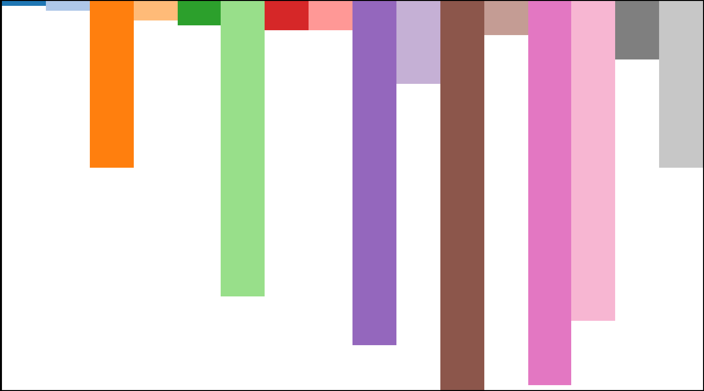
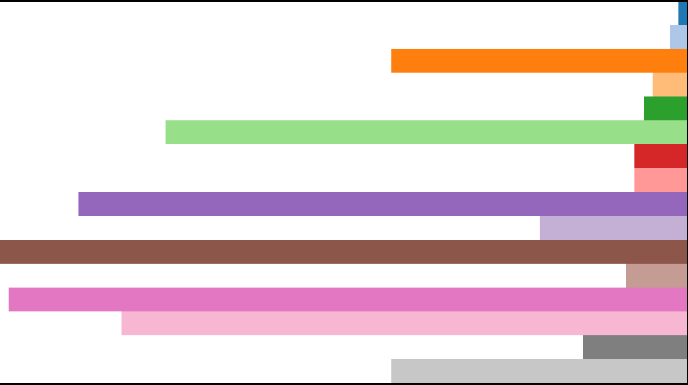
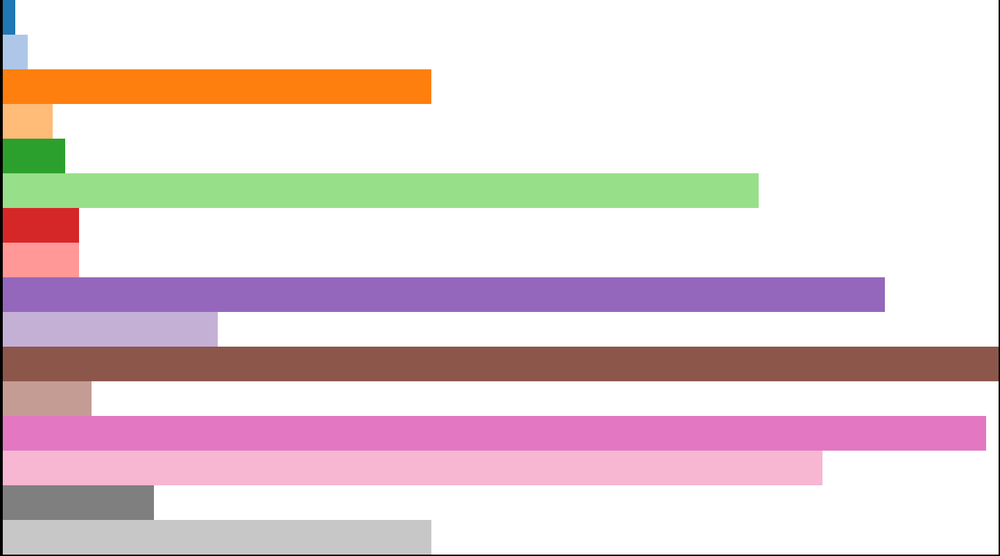
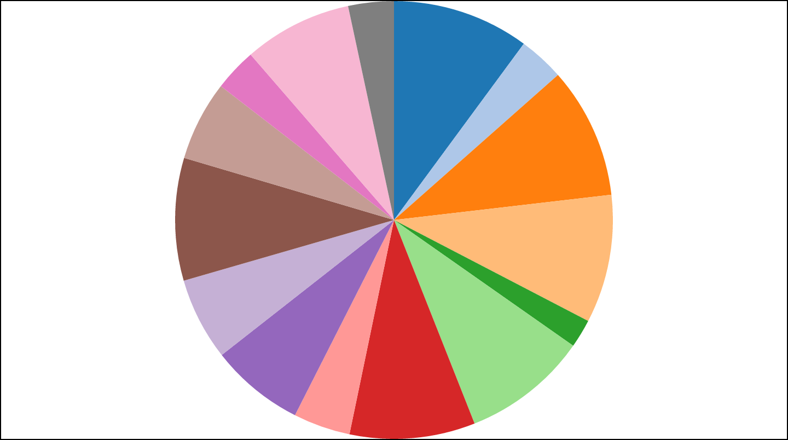
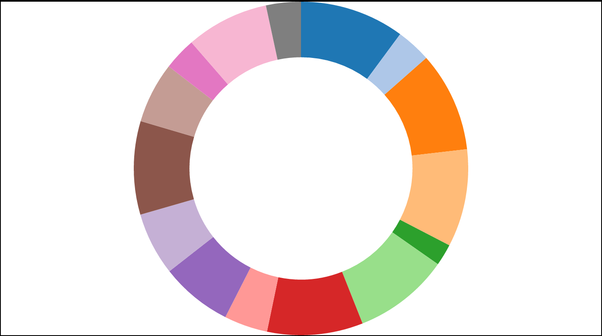
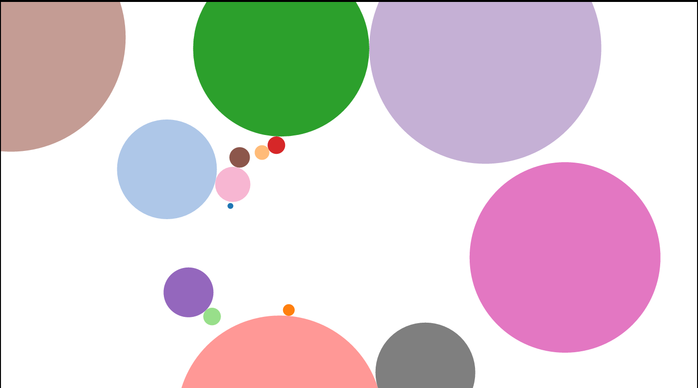
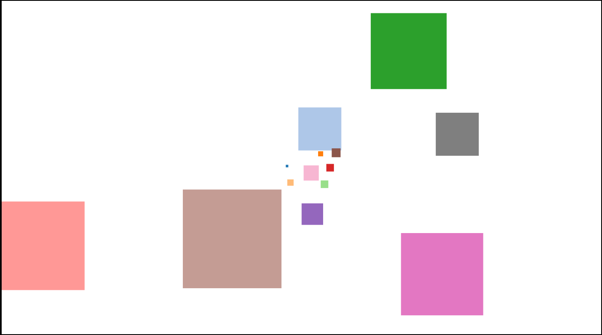

##d3zee Library

##Purpose
The purpose of this repository is to display an easy d3 repository.

##Description
So far, I have 8 methods that I have created, which is based off of the D3 library. You can fork and download this repo. By placing both the d3 library and my d3zee.js file in your project, you may use these methods.

For each method you will need to call in an element/class/id as the first argument. You are also responsible for sizing that element in your own CSS.

The second argument is your array of data. If your data is set up in objects, you will have to map through your data so that the number values are exposed as the value of each index.
  - For example [12,23,3,45,5] is a valid data set, where [{value: 12}, {value: 23}, {value: 3}, {value: 45}, {value:5}] is not a valid data set. In order to fix the second data set map through, as such data.map(function(x){return x.value;}).

The third argument is optional. If set to true, your chart will be animated.

Each method is described below.
 
##upBar
'upBar' is a chart with bar extending upward from the bottom of your div. The width of each bar is set based on number of array indexes you have in your data and the height is normalized based on the max value in your array.

 
##downBar
'downBar' is a chart with bar extending downward from the top of your div. The width of each bar is set based on number of array indexes you have in your data and the height is normalized based on the max value in your array.

 
##leftBar
'leftBar' is a chart with bar extending to the left from the right side of your div. The height of each bar is set based on number of array indexes you have in your data and the width is normalized based on the max value in your array.

 
##rightBar
'rightBar' is a chart with bar extending to the right from the left side of your div. The height of each bar is set based on number of array indexes you have in your data and the width is normalized based on the max value in your array.

 
##pie
'pie' is a simple pie chart where each slice is normalized based on the percent of total values in your array. The height and width are of equal value based on which is smaller in your selected element/class/id.

 
##donut
'donut' is a simple donut chart very similar to the pie chart. Each slice is normalized based on the percent of total values in your array. The height and width are of equal value based on which is smaller in your selected element/class/id.

 
##forceCircles
'forceCirces' is a chart with circles where the radius is sized by normalizing them to your element/class/id size. The circles also have an inherent gravitational push away from your cursor and a pull to the center of your element/class/id.

 
##forceSquares
'forceSquared' is a chart with squares similar to that of forceCircles where the square dimensions are sized by normalizing them to your element/class/id size. The squares also have an inherent gravitational push away from your cursor and a pull to the center of your element/class/id.

 
##Copyright

(c) Sol Innovations via [www.nickmarucci.com](http://www.nickmarucci.com), 2016.
